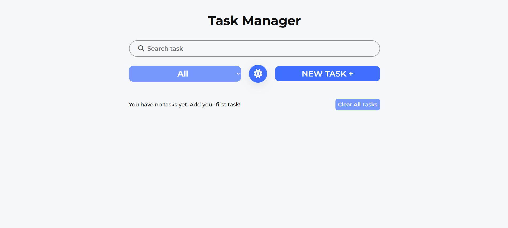
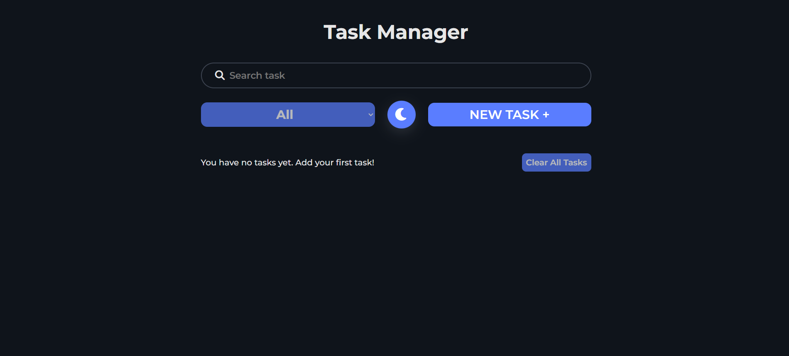

# 📝 Task Manager App

A clean and minimal **Task Manager application** built with **Vanilla JavaScript**, focusing on UX, state management, and modern UI practices.

---

## 🔗 Live Demo

👉 **[View Live Site](https://task-manager-sadri.netlify.app/)**

---

## 📸 Screenshots

### Desktop View

### Dark Mode

---

## ✨ Features

- Add, edit, delete tasks
- Mark tasks as completed or pending
- Live search with instant results
- Filter tasks (All / Completed / Pending)
- Dark & Light theme toggle
- Persistent data using `localStorage`
- Clean and responsive UI

---

## 🛠 Built With

- HTML5
- CSS3 (Flexbox / modern layout)
- Vanilla JavaScript (ES6+)
